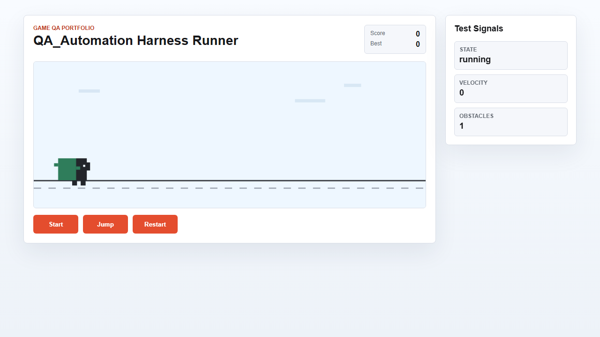

# 최신 검증 리포트

기록일: 2026-09-14 KST. 2026-09-13~14에 걸친 로컬 Windows 검증이다. 미커밋 작업 트리 기준이며 GitHub 원격 실행 결과가 아니다.

| 검증 | 명령/방법 | 결과 |
| --- | --- | --- |
| 단위 | npm test (JSON reporter 포함) | 74 통과, 0 실패 |
| E2E 수정 전 반복 | npm run test:e2e -- --repeat-each=3 | 11 통과, 1 실패 |
| E2E 수정 후 반복 | 같은 명령 | 12 통과, 0 실패, retry 0 |
| 의도 실패 4개 | 별도 evidence spec 실행 | 예상대로 종료 코드 1; 실제 증거 후속 확인 |
| 실험 증거·분류 | node scripts/verify-experiments.js | 4개 기대 분류 일치, 캡처 불가 시 JSON 보존 |
| 통합 요약 | node scripts/summarize-results.js | 정상 Unit/E2E 별도 집계 |

## 재현된 문제와 조치

- HAR-001: 최종 score=1인데 matched=false. 마지막 허용 프레임 검사 누락 수정. 초기/중간/최종/미충족 회귀 포함.
- TC-008-04: 병렬 반복 중 재시작 후 UI와 내부 상태를 읽는 사이 점수 0→1. 제품의 정상 시간 진행을 테스트 실패로 만든 관찰 시점 문제. 브라우저 clock을 고정하고 1프레임만 진행해 동일 기대 score=0으로 재검증했다. 실패를 없애려고 허용 점수 범위를 넓히지 않았다.
- DIAG: 일반 TypeError/locator timeout과 근거 충돌은 REVIEW_REQUIRED. 제품 콘솔 단어로 테스트 원인을 확정하지 않는다.
- EVID-001: 닫힌 페이지 screenshot 실패를 capture-status로 남기고 metadata/log/state/원본 오류 파일 생성 확인.

## 공유 가능한 증거

[실행 수치 JSON](samples/verification.json), [결함 주입 metadata](samples/EXP-001-metadata.json), [캡처 불가 기록](samples/EVID-001-capture-status.json).

EXP-001은 실제 출시 게임 버그가 아닌 통제된 결함 주입 실험이다. screenshot만으로 원인을 확정하지 않고 metadata와 원본 오류를 함께 본다. 전체 로컬 증거는 artifacts/playwright-evidence/에 실행별 UUID로 보존했다.

## 제한

4개의 정상 E2E를 3회 실행한 제한된 검증이다. 다중 브라우저·장시간 안정성·프레임률·외부 환경 일반화는 확인하지 않았다. 원격 CI 실행 URL은 아직 없다. 이전 결과는 [과거 이력](history/2026-09-13-before-revision.md)에 보존했다.

## 의존성 후속 검증

Vitest 4.1.11과 qs 수정 버전으로 갱신 후 npm audit 0건, 단위 74개 및 반복 E2E 12개 통과. [버전·근거](dependency-review.md)
